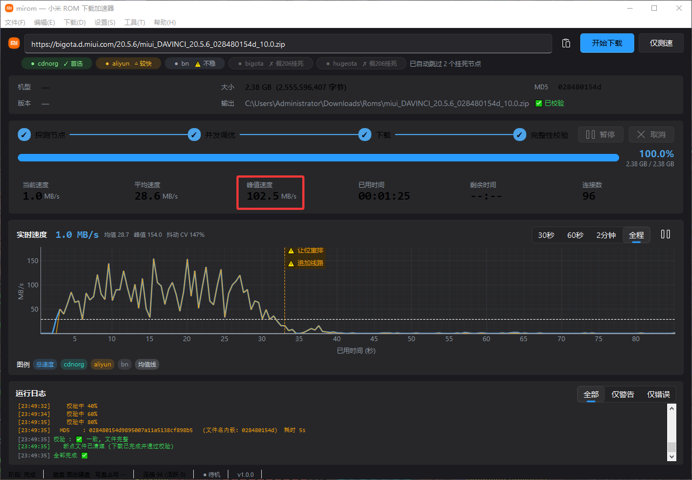

<div align="center">


# mirom

**小米 ROM 官方下载加速器**

把小米官网 1 MB/s 的龟速下载，变成 100 MB/s

**by poposjj**

[](LICENSE)
[]()
[]()

</div>

---

>小米官方 CDN 对**每一条连接**单独限速到约 1 MB/s。浏览器只开几条连接，所以 7 GB 的刷机包要下两个小时。mirom 同时开几百条连接去抢，把总带宽吃满 —— 实测千兆网下能跑到 **100 MB/s 以上**。

---

---

<div align="center">



**实测截图**：2.38 GB 的包 **1 分 25 秒**下完，峰值 **102.5 MB/s**，MD5 校验一致

</div>

---

# 第一部分 · 使用教程与功能介绍

## 一、这个软件能干什么

小米官方有 5 个下载节点，但它们的质量**天差地别**：

| 节点 | 实际情况 |
|---|---|
| `cdnorg` | ✅ 最稳，首选 |
| `aliyun` | 🔶 单连接很快，但抖动大、尾部会突然塌陷 |
| `bn` | ⚠️ 时快时慢 |
| `bigota` | ❌ 看着能用，实际被限速到 **16 KB/s** |
| `hugeota` | ❌ 同 bigota |

**bigota 和 hugeota 是最坑的两个**：它们会返回完全正常的 `206` 响应和完整的 `Content-Length`，看起来一切正常 —— 但实测每秒只吐一个 16KB 的数据包，永远吐不完。普通下载工具会被骗进去，然后卡在那里一动不动。

mirom 会自动识别并跳过这类节点，只在真正能跑的节点上开高并发。

**实测成绩**（本机千兆网络）：

| 机型 | 大小 | 耗时 | 平均速度 |
|---|---|---|---|
| marble（Redmi Note 12 Turbo） | 6.898 GB | 1:39 | 71 MB/s |
| renoir（小米 11 Lite 5G NE） | 5.795 GB | 1:30 | 65 MB/s |
| pipa（Xiaomi Pad 6） | 4.713 GB | 1:39 | 48 MB/s |
| davinci（Redmi K20） | 2.380 GB | 0:42 | 57 MB/s |
| lime（Redmi 9 印度版） | 3.637 GB | 0:51 | 72 MB/s |

全部通过**文件名内嵌 MD5** 校验。

---

## 二、怎么用（小白看这里）

### 1. 直接运行

解压后双击 `mirom.exe` 即可。**免安装，不用装 Python。**

> ⚠️ 必须整个文件夹一起用，不能只拷 `mirom.exe` —— 同级 `_internal` 目录里是运行库。

### 2. 下载一个 ROM

1. 把小米 ROM 的下载链接粘到最上面的输入框
   （形如 `https://bigota.d.miui.com/.../xxx.zip`）
2. 点「**开始下载**」
3. 等它跑完，文件在 `C:\Users\你的用户名\Downloads\Roms`

**第一次用建议先点「仅测速」**：它只探测节点速度、不在磁盘上写任何东西，让你先看看当前网络下哪条线路最快。

### 3. 设置（Ctrl+,）

以前这些参数只能在命令行敲，现在界面上就能改，改完自动记住：

| 项目 | 说明 |
|---|---|
| 下载目录 | 文件放哪儿 |
| 并发连接数 | `0` = 自动调优（推荐）。手填会跳过并发爬坡 |
| 自动调优上限 | 自动调优时允许的最大连接数（默认 256） |
| 限速 | `0` = 不限速。限的是**总带宽**，所有连接共享 |
| HTTP 代理 | 留空不用。例 `http://127.0.0.1:7890` |
| 多线路聚合 | 把多条 CDN 线路的带宽加起来，通常更快 |
| 完成后校验 MD5 | **建议一直勾着**，这是文件没坏的唯一保证 |
| 预分配磁盘空间 | 避免边下边碎片化，机械盘建议勾选 |
| 每次重新调优 | 默认复用 24 小时内的测速结果 |
| 跳过证书校验 | 只有公司中间人代理环境才需要 |

### 4. 界面怎么看

```
┌─ 彩色标签 ────────────────────────────────────────┐
│  绿 = 首选   橙 = 较快   灰 = 已被限速，已排除      │
│  「已自动跳过 N 个劣质节点」说明保护生效了           │
└──────────────────────────────────────────────────┘

┌─ 折线图 ──────────────────────────────────────────┐
│  蓝线 = 总速度   青线 = 单条线路   虚线 = 均值      │
│  黄色标记 = 事件（什么时候换了线、加了连接）         │
│  右上角可切 30秒 / 60秒 / 2分钟 / 全程             │
└──────────────────────────────────────────────────┘

┌─ 阶段条 ──────────────────────────────────────────┐
│  探测节点 → 并发调优 → 下载 → 完整性校验            │
│  「并发调优」是在找最佳并发数，不是出错，等它跑完     │
└──────────────────────────────────────────────────┘
```

### 5. 暂停和取消

| 操作 | 实际行为 |
|---|---|
| 暂停 | 有约 4~5% 的粒度（正在传的分片要写完才停）。这是为了保证续传不出洞 |
| 取消（探测/调优阶段） | 数秒内停下 |
| 取消（下载阶段） | 约 6 秒收尾 |
| 取消（校验阶段） | 不可中断，跑完即停 |

### 6. 断点续传

中途关掉软件再打开，重新点「开始下载」会自动接着下。

- 进度记录在 `<文件名>.mirom.json` 里
- **下载完成并校验通过后，断点文件会被自动删除** —— 这是正常的
- 下次再下同一个文件会直接秒过（校验通过就不重复下载）

### 7. 已经有同名文件怎么办

点「开始下载」时会先弹窗问你，**不会默默跳过**：

| 选项 | 行为 |
|---|---|
| **下载副本** | 保留原文件，另存为 `xxx (1).zip` 后照常下载 |
| 覆盖重下 | 删掉旧的重新下一份，完成后照常校验 |
| 跳过 | 不下载，只校验现有文件；通过就算完成 |
| 取消 | 什么都不做 |

`(1)` 被占了会自动用 `(2)`、`(3)`…，**绝不覆盖任何已有文件**。

> 例外：如果那个文件带有 `.mirom.json` 断点文件，说明是"上次没下完"，这时不会弹窗，直接续传。

### 8. 工具菜单

- **运行引擎自检** — 跑完弹结果窗，同时把完整逐项结果写进日志
- **导出本次测试数据 CSV** — **仅测速之后就能导出**，不必先下载完
- **诊断报告** — 把环境信息 + 完整自检结果存成文件，遇到问题直接发出来

导出的 CSV 包含五张表：

```
① 节点探测      每个节点的 TTFB、服务器、是否可用、被限速节点的实测速率
② 单连接基准    识别"是不是单连接限速"
③ 并发爬坡      每一档连接数的吞吐与抖动 —— 拐点一目了然
④ 下载实时速度  有下载才有这一份
⑤ 关键事件      换线、重排等发生在第几秒
```

### 9. 快捷方式与开机自启

「设置」菜单里：

- **创建桌面快捷方式** — 在桌面建一个带正确图标的快捷方式
- **开机自动启动** — 默认关闭。勾选状态读的是系统里的真实情况，你手动删掉启动项它也会自动变回未勾选

### 10. 命令行用法（可选）

```bash
mirom.exe                        # 正常启动图形界面
mirom.exe --diag 报告.txt        # 导出环境 + 自检报告
mirom.exe --desktop 2            # 启动后移到第 2 个虚拟桌面

# 引擎也能脱离界面单独跑（需要 Python 环境）
python mirom.py --selftest       # 跑自检（约 10 秒）
python mirom.py <链接>            # 命令行下载
python mirom.py <链接> --probe   # 只测速，不写任何文件
```

常用参数：

| 参数 | 说明 |
|---|---|
| `-o, --outdir` | 输出目录 |
| `--conns` | 手动指定总连接数 |
| `--max-conns` | 自动调优上限（默认 256） |
| `--limit` | 总带宽上限（MB/s） |
| `--proxy` | HTTP 代理 |
| `--multi` | 多线路聚合 |
| `--single` | 只测单连接最快的那条线 |
| `--retune` | 强制重新做并发调优 |
| `--force` | 已存在且校验通过也强制重下 |
| `--no-verify` | 跳过 MD5 校验 |
| `--include-dead` | 也探测已知劣质的 bigota / hugeota |
| `--no-prealloc` | 跳过磁盘预分配 |

---

## 三、常见问题

**Q：速度忽上忽下？**
A：CDN 本身波动就有 2 倍差距。同样的代码、同一个文件，测出来可能是 1分39秒，也可能是 3分19秒。工具会自动调整并发数并切换线路，看「平均速度」比看瞬时值靠谱。

**Q：卡在 0% 不动？**
A：大概率是你手动指定了 bigota / hugeota 这类节点。删掉链接重开，让它自动选路。

**Q：进度条到 100% 了但还没结束？**
A：进度是按「真正落盘、可续传的单元」算的，不会虚高。到 100% 后还在跑，那是在做最后的完整性校验 —— 这一步要把整个文件读一遍算 MD5，大文件要几秒到十几秒。

**Q：报「完整性校验失败」？**
A：文件在传输中损坏了。直接重跑同一条命令即可 —— 工具会检测到校验不通过并自动重新下载整份文件。

**Q：点按钮的时候闪过一个黑框？**
A：那是旧版本的问题，现在已经隐藏。工具需要问系统"你这是固态还是机械盘"，旧版会起一个 PowerShell 窗口（冻结的 EXE 没有控制台，Windows 就给子进程新开一个）。现在不仅隐藏了，同一个盘还只问一次。

**Q：提示「输出路径过长」？**
A：Windows 默认路径上限 260 字符。把下载目录换浅一点，例如 `D:\Roms`。

**Q：杀毒软件报警？**
A：PyInstaller 打包的 Python 程序常见误报，源码完全公开，可自行审查。

---

## 四、环境要求

- Windows 10 / 11 64 位（源码版也支持 Linux / macOS）
- 免安装，解压即用
- 整个文件夹必须一起拷贝

---

# 第二部分 · 实现思路

> 这一部分记录**为什么这样写**。所有结论都来自实测抓包，不是推测。

## 一、慢的根因：单连接限速，不是总带宽不够

实测单条连接的速率：

```
cdnorg   1.12 MB/s   ← 典型单连接限速
bn       1.25 MB/s   ← 同上
aliyun  20.12 MB/s   ← 单连接就很快，但抖动大
```

所以**堆并发是唯一出路**。但并发不是越高越好 —— 存在一个拐点：

```
 64 连接 →   79.46 MB/s | 抖动 CV 53.2%
128 连接 →   89.84 MB/s | 抖动 CV 58.3%
192 连接 →   90.30 MB/s | 抖动 CV 54.2%
```

过了 192 之后收益极小、抖动反而更大。程序会自动爬坡找这个拐点，并**优先选"既快又稳"的线路**（用户的原始诉求就是"不要忽上忽下"）：

- 吞吐明显高出 **15%** → 换线（快到可以容忍抖动）
- 速度相差在 ±15% 内，但抖动不到其 **3/4** → 换线（用稳定性换掉微小速度差）

实测意义：aliyun 常比 cdnorg 快 5~8%，但抖动是它的 2~3 倍，且尾部会突然塌陷 —— 这种"看起来快一点"的节点不该被选中。

## 二、bigota / hugeota 不是挂死，是被限速到 16 KB/s

这是本项目最重要的发现。它们返回完整的 `206 + Content-Length`，看起来完全正常，但实测每秒只吐一个 16KB 包，**而且一直吐、不停**：

```
0.00s +16384 累计  16KB     4.00s +16384 累计  96KB
1.00s +16384 累计  32KB     8.00s +16384 累计 176KB
2.00s +16384 累计  48KB    12.00s +16384 累计 256KB
```

这个区别**很关键**，因为它决定了正确的读法：

- 数据**一直在到达** → socket 超时永远不会触发，靠 `settimeout` 拦不住
- 旧的 `read(256KB)` 会一直阻塞到攒够 262144 字节 = 约 **12 秒**，把 8 秒的检测预算顶穿

正确做法是 **32KB 小块读 + 每次按剩余预算设超时**，让 deadline 真正说了算。改完之后单节点检测从 12.15 秒降到 8.29 秒，而且报出的是**实测速率**而不是写死的"8秒"：

```
bigota  ✗ 不可用  限速 20 KB/s (8 秒只收到 160 KB, 无法使用)
```

## 三、高并发分片 + 工作窃取

朴素做法是"把文件切成 N 份，每条连接一份"。问题是**快线路线程早早干完就闲着了**。

mirom 用的是**共享分片队列**：

```
所有连接 ← 共享队列 ← 自适应分片
   ↑                      ↓
   └── 动态分裂/合并 ──────┘
```

- 快的连接多干活，慢的连接少干活
- 分片大小自适应：让分片数至少是连接数的 **2 倍**，避免"分片比连接还少，一堆连接空转"
- 但**不小于 2 MB** —— 实测过度细分会让 CDN 触发请求频率限流，吞吐从 96 MB/s 崩到 3 MB/s

## 四、尾部防塌陷

下载到 90% 之后，队列往往已经空了，剩余工作全被在途连接攥着。此时新加的备用线路连接**抢不到活只能空转退出**。

处理办法（"让位"）：

1. 把**最大的若干个**在途分片切成剩余部分，还回队列
2. 再补备用线路去认领

> ⚠️ 踩过的坑：最初是"让所有在途连接全部让位"，一次甩出 230+ 个碎片，4 次重排等于近千个新 HTTP 请求 → CDN 直接限流，**0.00 MB/s 卡死 + 重试飙到 144 次**。所以必须只让位最大的 K 个，不做全量重排。

## 五、进度判据：位图，不是"写了多少字节"

这是一个很隐蔽的坑。

`written` 计数器每写一个字节就 +1；而完整性位图只在**整块分片下完**时才标记。两者在传输途中必然有差：

```
written 2446.7 MB | 位图 2415.0 MB | 差最大到过 485.5 MB
```

485 MB 是整份文件的 **20%**！用 `written` 算进度的后果：

- 进度条最多虚高 20%
- 而且 `written` 会**超过文件大小** → 被 `min()` 一夹，进度条在文件还差 22MB 时就显示 `100.00%`，然后长时间卡住不动 —— 用户会以为程序死了

**改法**：位图改为**按 1MB 单元增量标记**（不再是整块分片下完才标记）。差值从 659.5 MB 降到 **42 MB（1.7%）** —— 正好等于"每条在途连接手里那半个单元"，是理论下限。

设 `MIROM_DEBUG_ACCT=1` 可以实时看到这项体检：

```
[记账] written 909.0 MB | 位图(权威) 874.0 MB | 虚高 35.0 MB | 超出文件大小 0.0 MB
```

## 六、续传判据：有没有断点文件，不是"文件在不在"

取消后的数据文件是**预分配**过的 —— 大小和完整文件一模一样。所以"文件存在且大小相符"**区分不出**"下好了"和"下了一半"。

写错的后果是每次续传都要把整个文件重算一遍 MD5（2.4GB 要 4 秒，7GB 要十几秒），算完必然"不通过"，再拿这个假结论去重下 —— **续传等于白做**。

正确逻辑：

```
有断点文件  → 这是续传, 交给 load_state() 恢复, 别插嘴
无断点文件  → 才可能是"上次下好了没删", 值得花一次 MD5 确认
```

还有一条：**校验通过后要删掉断点文件**。留着它的话位图是全满的，文件后来被改坏、用户重跑时 `load_state()` 会恢复出"全部已完成"，一个分片都不下，最后又报校验失败 —— 重跑多少次都修不好。删掉之后重跑会走"检测到同名文件 → 校验 → 通过就跳过 / 坏了就重下整份"，两条路都对。

## 七、取消必须是线程级的

探测节点 + 单连接基准测速这两个阶段合计 **40 秒以上**，而它们都发生在 `Downloader` 创建**之前**。

如果取消只认 `Downloader.stop`，这 40 秒里点取消**完全无效** —— 而界面还在打印"已请求取消"骗用户。

修法：加一个线程级取消标志，在阶段边界、`autotune` 内部、`stall_check` 内部都能查到。

| 取消点 | 修复前 | 修复后 |
|---|---|---|
| 5s（探测阶段） | 无响应 | 0.0s |
| 12s（探测阶段） | 无响应 | 2.3s |
| 20s（测速阶段） | 无响应 | 0.1s |
| 45s（下载阶段） | 6.2s | 2.2s |

## 八、不假设你的磁盘类型

程序会先探测再决定策略：

| 介质 | 并发上限 | 说明 |
|---|---|---|
| 固态盘 | 256 | 按网络调优 |
| 机械盘 | 192 | 实测大块并发散写**不会踩踏** |
| 网络盘 | 8 | 每次写都有网络往返，必须收敛 |
| 可移动介质 | 16 | 带宽有限 |

机械盘为什么不必降并发？实测数据（512KB 块，全部 `fsync`）：

```
机械盘 (WDC WD10EZEX)   顺序写 175.7 MB/s
                        1/16/64/192 线程并发散块写 = 179.4 / 180.3 / 178.9 / 178.0 MB/s
固态盘 (Samsung 980PRO) 顺序写 1554.9 MB/s
                        16~64 线程最佳 (2390/2288)，192 线程回落到 1081 MB/s
```

> 探测用的是 Windows 的 `Get-PhysicalDisk`（起一个 PowerShell 子进程）。冻结的 `--windowed` EXE 本身没有控制台，Windows 会给子进程**新分配一个控制台窗口** —— 就是那个一闪而过的黑框。所以所有子进程调用都带 `CREATE_NO_WINDOW` + `SW_HIDE` 双保险，并且同一个盘符只问一次（缓存）。

## 九、正确性怎么保证

这类工具最容易出的错不是"跑不起来"，而是**跑起来了但文件是坏的** —— 而且坏得悄无声息。所以内置了三层自检，`python mirom.py --selftest` 随时可跑：

**1. 静态体检：未定义名**

用标准库 `symtable` 扫出"引用了但根本没定义"的名字。`compile()` 抓不到这类错（它只查语法），要到真正跑到那一行才炸 —— 而那一行往往在"取消""出错"这种很少走到的分支里。

这个检查在开发中抓到过 **4 次**真 bug：两次是改名（`aborted` → `cancelled`）漏掉调用点，两次是漏 import。

**2. 记账不变式**

守住"进度不能虚高"（见第五节）。

**3. 完整性闸门 + MD5**

下载结束先逐单元确认位图无空洞，再从**文件名内嵌的 MD5 前缀**提取期望值比对。

## 十、其他实测踩过的坑

**重定向到文件时不能假定有终端**
`sys.stdout is None` 时 `print()` 是静默 no-op，但 `.isatty()` / `.write()` 会直接崩。PyInstaller `--windowed` 出来的 EXE 就是这个环境，必须全程判空。

**同名文件冲突不能默默跳过**
引擎发现同名文件 + MD5 通过就直接返回成功，用户以为工具坏了。现在弹窗给四个明确选项。

**带查询串的链接会生成非法文件名**
`...zip?token=ABC` 里的 `?` 在 Windows 是非法字符，`open()` 会炸；而且内嵌 MD5 也提取不出来（正则要求 `.zip` 结尾）→ **静默跳过校验**。现在请求路径保留查询串，本地文件名剥掉。

**配置文件是面向用户的**
调优缓存里只要有一个字段类型不对，就会在"探测完、调优刚开始"那一刻崩掉 —— 用户已经白等了 25 秒。而界面菜单里就有"打开调优缓存"，等于鼓励用户手改。现在逐字段校验，坏条目丢掉即可。

---

# 项目结构

```
mirom/
├── mirom.py                    引擎 + 命令行 (跨平台, 纯标准库)
├── mirom_gui.py                图形界面 (PySide6 + PyQt-Fluent-Widgets)
├── vdesk.py                    Windows 虚拟桌面支持
├── requirements.txt            图形界面依赖 (引擎本身零依赖)
├── CHANGELOG.md                更新日志 + 开发中踩过的坑
├── assets/                     图标 (源图 + 自动生成的全套)
├── docs/使用说明.txt             面向小白的纯文本说明
├── .github/
│   ├── workflows/build.yml     CI: 测试 → 打包 → 推 tag 时自动发 Release
│   ├── ISSUE_TEMPLATE/         问题反馈模板 (带诊断报告栏位)
│   └── PULL_REQUEST_TEMPLATE.md
├── tests/                      三套自动化测试, 共 246 项
│   ├── test_edge.py                边界条件 (断点容错/路径/限速/锁…) 108 项
│   ├── test_settings.py            设置系统、GUI 流程、图标与帮助接线 137 项
│   └── test_gui_buttons.py         全按钮遍历 44 项
└── tools/
    ├── build.py                打包主逻辑 (本地与 CI 共用, 避免参数漂移)
    ├── 打包.bat                 双击即打包, 内部调用 build.py
    ├── make_logo.py            从 webp 生成全套图标 + 多分辨率 ico
    ├── version_info.txt        EXE 属性页信息 (作者署名)
    ├── publish_github.py       把源码发布到 GitHub (无需本地 git)
    └── release_github.py       压 zip 并发到 Releases
```

## 从源码运行

```bash
pip install -r requirements.txt
python mirom_gui.py
```

> 只想用命令行的话**什么都不用装** —— `mirom.py` 是纯标准库的：
> ```bash
> python mirom.py <链接> --probe      # 只测速，不写盘
> python mirom.py <链接>              # 直接下载
> python mirom.py --selftest          # 跑自检
> ```

## 自己打包

双击 `tools\打包.bat`（需要 Python 3.8+）。它会先装齐依赖，再调 `tools/build.py`。

打包脚本刻意只有一份：`tools/build.py`。本地和 GitHub Actions 都调它 ——
要是把那一长串 `--exclude-module` 在两边各写一遍，某天本地排掉一个 Qt 模块，
CI 打出来的包就跟本地不一样了。

```bash
python tools/build.py            # 完整打包
python tools/build.py --zip      # 打完再压一个 zip
python tools/build.py --skip-logo  # 图标没改时省几秒
```

## 跑测试

```bash
python mirom.py --selftest          # 引擎自检 (约 10 秒)
python tests/test_edge.py           # 纯逻辑, 不联网
python tests/test_settings.py       # GUI 设置系统, 不联网
python tests/test_gui_buttons.py    # 全按钮遍历 (会真下载, 需要网络)
```

## 自动构建

仓库带了 GitHub Actions 工作流，不需要 Windows 机器也能拿到 exe：

- **推到 `main`** → 自动跑测试 + 打包，产物在 Actions 页面的 Artifacts 里
- **推一个 `v*` 标签** → 额外自动创建 Release 并附上 zip
- **手动触发** → Actions 页面点「Run workflow」，可以勾选是否同时发 Release

工作流里除了构建，还会**从产物本身再验一遍**：EXE 属性页的作者信息、
内嵌图标帧数（少于 5 帧任务栏图标会糊）、`assets` 里有没有 0 字节文件 ——
光看"构建没报错"是不够的。

---

# 免责声明

- 本工具只做「更快地下载小米官方服务器上的公开文件」，**不修改、不重打包、不绕过授权**。
- 所有下载内容均来自小米官方 CDN 域名（`*.d.miui.com` / `*.aliyuncs.com`）。
- 刷机有风险，请自行确认机型与固件匹配。本工具不对刷机后果负责。
- 请遵守小米的服务条款与当地法律法规。

# License

MIT © 2026 poposjj

---

<div align="center">

**mirom** · by **poposjj** · MIT License

</div>
